# 一、运行
## 1. 仿真
修改`settings.json`中`"MODE": "Simulation"`
    "IsRC": false,

将_ShootBall拷贝到Windows中。双击运行`_ShootBall/client_ue4_SITL.bat`

Linux中运行
`./simulation/shell/rfly-sitl.sh`
或者
`./simulation/shell/rfly-hitl.sh`

QGC中起飞到4m左右，聚焦Linux小窗口上，按`O`进入offboard模式，按`A`开始打击。（相当于模拟遥控器按B键和A键）

## 2. 实飞
修改`settings.json`中`"MODE": "RealFlight"`
    "IsRC": true,

修改`offboard_pkg/script/utils_obs.py`第194行n_td打击方向

运行
`./offboard_pkg/shell/all.sh`
或者
`./offboard_pkg/shell/all_high.sh`
或者
`./offboard_pkg/shell/all_acc.sh`
或者
`./offboard_pkg/shell/all_high_startup.sh`

# 二、飞行前准备

## 0. 物品清单
北航
* 飞机、遥控器、电池
* 两个三脚架
* 电脑、硬盘、充电宝、网口、网线
* 代码备份

优联
* 气球、气罐、线
* 备用机、遥控器
* 若干电池、充电器
* 钓鱼凳

## 1. 测试气球
充气一个气球，连接线并放飞和收回

## 2. 测试颜色
* 打开`csi_cam/src/csi_cam.cpp`第155到162行，编译。
* 测试能否在图像上看到气球，是否干净。
* 通过`simulation/script/get_hsv.py`获取合适的hsv值。
`csi_cam/src/csi_cam.cpp`第25到30行，编译。
* 测试多远到多近可以看到气球

## 3. 改时间
`sudo date -s "2023-03-28 00:12:30"`

# 三、实验

## 0. 关闭输出和显示
测试完成后应关闭终端输出和图像显示

`ekf_pkg/src/img_imu_ekf_node.cpp`第343-344行，显示图像并画ekf图像位置

## 1. 参数 ※※※※※
* 前向最大速度，`offboard_pkg/script/utils_obs.py`第57行
`self.v_norm_d = 15`
* <kbd>第52行`self.v0 = self.h*0.43`图像中心
* 第216-217行横向和纵向控制增益
* <kbd>第59行焦距
* 第168行加速度


## oo. 实验后
保存文件到移动硬盘
* 保存`offboard_pkg/bag/`下本次bag
* 保存`.ros/log/`下本次log文件夹


# 四、画图

**[new] 论文图均在`paper_plot\`文件夹下运行**

**图1-5在`simulation\statistics\`路径下运行。**

均使用`Python3`运行，保证多平台通用。Linux默认python2，Windows中先运行`conda activate py2_env`切换环境。

## 1. The trajectory of the interceptor and the target when the image measurement is filtered at 30Hz.
画50组实验的全体轨迹图，可以修改`datas_30Hz_ekf.pkl`为其他统计结果
```
# python draw_trajectory.py
python 1-draw_trajectory.py
```
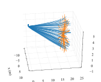

## 2. Boxplots of control error for EKF 
画30hz下有无EKF的误差对比箱线图
```
# python CEP_with_ekf.py
python 2-CEP_with_ekf.py
```


## 3. Boxplots of control error for different image frequencies 
画不同图像频率下误差对比箱线图
```
# python CEP_with_rate.py
python 3-CEP_with_rate.py
```
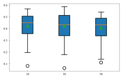

## 4. Error distribution at 10Hz、30Hz、50Hz 
画不同图像频率下撞击点散点图和圆概率误差
```
# python scatter_with_rate.py
python 4-scatter_with_rate.py
```
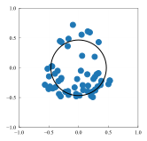
CEP_10Hz: 0.466656341936

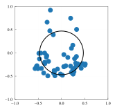
CEP_30Hz: 0.470425914344

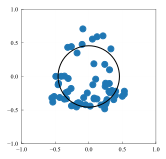
CEP_50Hz: 0.4568409922

## 5. Error distribution with EKF 
画有EKF下撞击点散点图和圆概率误差
```
# python scatter_with_ekf.py
python 5-scatter_with_ekf.py
```
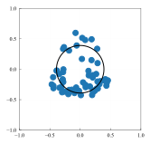
CEP_30Hz_ekf: 0.39116126392


**图6-11在`analyse\`路径下运行。**
## 6. Results for HITL simulation. (a) trajectory
画仿真中相对目标的全局坐标轨迹图
```
# python plot_data.py ../datas/377504aa-b91c-11eb-9cde-000c29e163c9/main_node-3-stdout.log mav_pos -p -t "0 10"
python 6-plot_data.py ../datas/377504aa-b91c-11eb-9cde-000c29e163c9/main_node-3-stdout.log mav_pos -p -t "0 10"
```
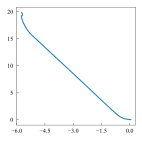

## 7. Results for HITL simulation. (b) image coordinates
画仿真中原始和滤波后图像坐标随时间变化图
```
# python plot_data.py ../datas/377504aa-b91c-11eb-9cde-000c29e163c9/ekf_node-2-stdout.log IMG_x ekf_x IMG_y ekf_y -t "10 37.5" --subplot 2
python 7-plot_data.py ../datas/377504aa-b91c-11eb-9cde-000c29e163c9/ekf_node-2-stdout.log IMG_x ekf_x IMG_y ekf_y -t "10 37.5" --subplot 2
```
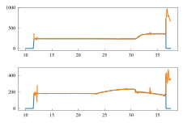

## 8. Results for HITL simulation. (c) local image coordinates
画仿真中原始和滤波后图像坐标随时间变化图局部放大图
```
# python plot_data.py ../datas/377504aa-b91c-11eb-9cde-000c29e163c9/ekf_node-2-stdout.log IMG_y ekf_y -t "30.2 32.25"
python 8-plot_data.py ../datas/377504aa-b91c-11eb-9cde-000c29e163c9/ekf_node-2-stdout.log IMG_y ekf_y -t "30.2 32.25"
python 8-plot_data.py ../datas/377504aa-b91c-11eb-9cde-000c29e163c9/ekf_node-2-stdout.log IMG_y ekf_y -t "35 37.5"
```


## 9. Results for real flight experiments. (a) trajectory
画实飞静态目标中相对目标的全局坐标轨迹图
```
# python plot_data.py ../datas/20210521_172502_sim.log mav_pos -t "51 61" -p
python 9-plot_data.py ../datas/20210521_172502_sim.log mav_pos -t "51 61" -p
```
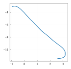

## 10. Results for HITL simulation. (b) image coordinates
画实飞静态目标中原始和滤波后图像坐标随时间变化图
```
# python plot_data.py ../datas/20210521_172502_sim.log IMG_x ekf_x IMG_y ekf_y -t "2 68.4" --subplot 2
python 10-plot_data.py ../datas/20210521_172502_sim.log IMG_x ekf_x IMG_y ekf_y -t "20 68.4" --subplot 2
```
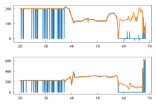

## 11. Results for HITL simulation. (c) local image coordinates
画实飞静态目标中原始和滤波后图像坐标随时间变化图局部放大图
```
# python plot_data.py ../datas/20210521_172502_sim.log IMG_y ekf_y -t "36.5 41"
# python plot_data.py ../datas/20210521_172502_sim.log IMG_y ekf_y -t "62.5 68.4"
python 11-plot_data.py ../datas/20210521_172502_sim.log IMG_y ekf_y -t "36.5 41"
python 11-plot_data.py ../datas/20210521_172502_sim.log IMG_y ekf_y -t "62.5 68.4"
```

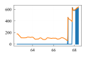


** 接下来参照`ekf_pkg/launch/img_ekf.launch`单独运行ekf保证帧率。运行后的结果拷贝到datas/里。 **

## 12. Results for real flight experiments. (a) trajectory
画实飞动态目标中相对目标的全局坐标轨迹图
```
# python 12-plot_data.py ../datas/2eb00a9e-ccc1-11ed-9ff8-c6766eff689d/ekf_node-1-stdout.log mav_pos -t "285 298" -p
python 12-plot_data.py ../datas/207692ec-eb14-11ed-94db-000c2992733c/ekf_node-1-stdout.log mav_pos -t "5 15" -p
```


## 13. Results for HITL simulation. (b) image coordinates
画实飞动态目标中原始和滤波后图像坐标随时间变化图
```
# python 13-plot_data.py ../datas/2eb00a9e-ccc1-11ed-9ff8-c6766eff689d/ekf_node-1-stdout.log IMG_x ekf_x IMG_y ekf_y -t "278 295" --subplot 2
python 13-plot_data.py ../datas/207692ec-eb14-11ed-94db-000c2992733c/ekf_node-1-stdout.log IMG_x ekf_x IMG_y ekf_y -t "5 15" --subplot 2
```
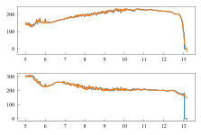

## 14. Results for HITL simulation. (c) local image coordinates
画实飞静态目标中原始和滤波后图像坐标随时间变化图局部放大图
```
# python 14-plot_data.py ../datas/2eb00a9e-ccc1-11ed-9ff8-c6766eff689d/ekf_node-1-stdout.log IMG_x ekf_x -t "286 288.5"
# python 14-plot_data.py ../datas/2eb00a9e-ccc1-11ed-9ff8-c6766eff689d/ekf_node-1-stdout.log IMG_x ekf_x -t "291.5 294"
python 14-plot_data.py ../datas/207692ec-eb14-11ed-94db-000c2992733c/ekf_node-1-stdout.log IMG_x ekf_x -t "5.3 6.3"
python 14-plot_data.py ../datas/207692ec-eb14-11ed-94db-000c2992733c/ekf_node-1-stdout.log IMG_y ekf_y -t "12.6 13.2"
```

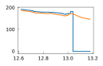

# 三、更多
## 1. 总体绘图逻辑
* 绘图前设置全局参数，保证所有图片风格一致。
* 然后设置画布大小，这样生成的图片无论什么格式，后续都不需要缩放。
* 编写数据处理和绘图程序，可以使用默认风格或自定义风格`style_dict`
* 最后按照需要自定义本图片的修改，通常修改坐标轴范围和刻度数量

## 2. 论文和文档使用图片
Python -> svg -> emf -> Visio -> PDF -> eps -> LaTex

常用尺寸：单栏83mm，双栏176mm

新电脑里需要安装`inkscape`，安装到`D:\Inkscape`，添加环境变量。
* `Python`中程序出图，得到`svg`和`emf`格式图片。其中`svg`或`emf`格式可以用于`Word`文档中使用。是可以无限放大的矢量格式。
* 注意`Python`画图时就应该确定图片尺寸，避免后续缩放
* 在`Visio`中进行图片拼接、加坐标注释、小标题等操作。预先设定`Visio`页面尺寸
* `PDF`中裁剪多余空白，转换为`eps`格式用于`LaTeX`和投稿。

## 3. 模板
* `paper_plot\1-draw_trajectory.py`可以作为3d图样板
* `paper_plot\5-scatter_with_ekf.py`可以作为常规图样板
* `paper_plot\params.json`定义了全局模式
* `paper_plot\plot_tools.py`定义了一些线型和一些工具
* `paper_plot\Matplotlib 优雅作图笔记 - 可乐学人.ipynb`相当全的教程
